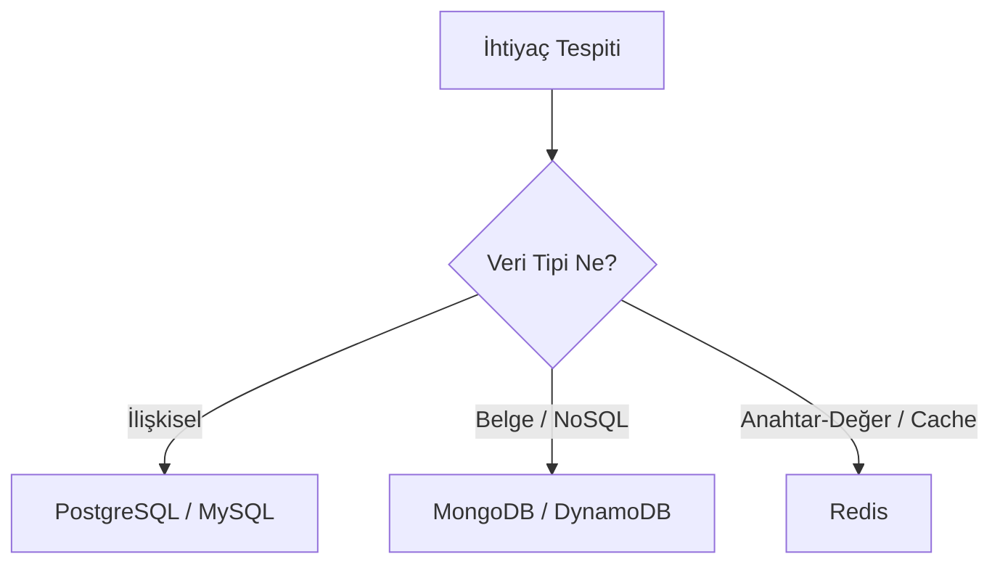

# 📐 Proje & Görev Planlama Yönergesi

## 🎯 Planlama Süreci

### 1. Yol Haritası (Roadmap) Şablonu
- **Faz 1 (MVP / Temel Mimarı):** Çekirdek veri modelleri, yetkilendirme, temel arayüz.
- **Faz 2 (Özellik Genişletme):** İşlevsel bileşenler, entegrasyonlar, otomasyon.
- **Faz 3 (Optimizasyon & Yaygınlaştırma):** SEO, performans optimizasyonu, analytics, dağıtım.

### 2. MoSCoW Önceliklendirme Metodu
- 🔴 **Must Have (Olmazsa Olmaz):** Sistemin çalışması için zorunlu kritik modüller.
- 🟡 **Should Have (Olmalı):** Önemli ancak ilk aşamada bypass edilebilecek özellikler.
- 🟢 **Could Have (Olsa İyi Olur):** Kullanıcı deneyimini artıran ikincil geliştirmeler.
- ⚪ **Won't Have (Şimdilik Yok):** İleride değerlendirilecek fikirler.

### 3. Karar Ağacı Yapısı

